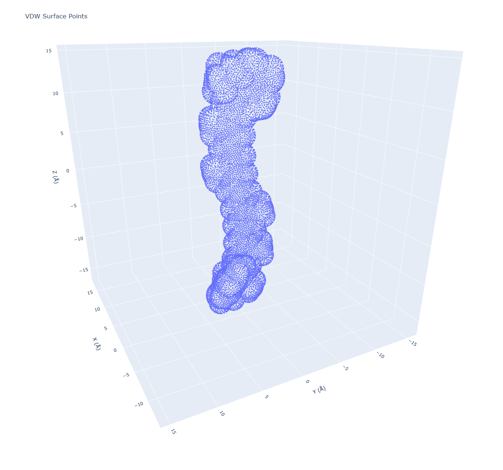
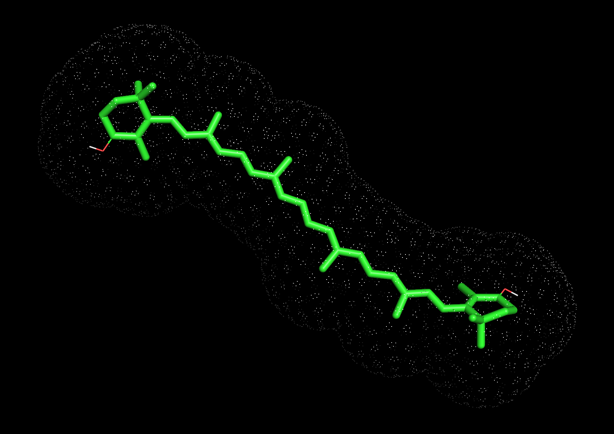

# Windows x64 pre-compiled pyvdwsurface

This repository demonstrates how to use the pre-compiled `pyvdwsurface` Python library to generate Van der Waals (VDW) surfaces from XYZ files and visualize them with Plotly.



*Example VDW surface plot generated for the test molecule (CAN.xyz) using `pyvdwsurface`.*



*Example VDW surface visualised with PyMol for CAN.xyz.*

## Original Project

The `pyvdwsurface` library itself is based on an open-source C++ implementation for calculating Van der Waals surfaces.  While this example repository provides a pre-compiled version, the original source code and more detailed information about the underlying algorithm might be available at the https://github.com/rmcgibbo/pyvdwsurface.  Please refer to the original project for licensing information, source code, and potentially more advanced usage details.

## Installation (Pre-compiled Wheel - Windows 64-bit, Python 3.13)

For **Windows 64-bit** users with **Python 3.13**, you can use the provided pre-compiled wheel file for easy installation:

**1. Download this repository:**

   ```bash
   git clone https://github.com/YOUR_USERNAME/pyvdwsurface-example.git
   cd pyvdwsurface-example
   ```

**2. Install using the pre-compiled wheel:**

   ```bash
   pip install dist/pyvdwsurface-0.1-cp313-win_amd64.whl -r requirements.txt
   ```

   **Note:** If you are not using Windows 64-bit and Python 3.13, you will need to compile `pyvdwsurface` from source (see instructions below).

## Compilation from Source (For other platforms or Python versions)

If the pre-compiled wheel is not suitable for your system, you can compile `pyvdwsurface` from source.  This requires a C++ compiler, Python development headers, Cython, and NumPy to be installed on your system.

**Prerequisites:**

*   **Python:** Python 3.x (ideally Python 3.7 or later). Make sure `python` and `pip` are in your system's PATH.
*   **C++ Compiler:**
    *   **Linux:** `g++` (or `clang++`). Install using your distribution's package manager (e.g., `sudo apt-get install g++` on Ubuntu/Debian, `sudo yum install gcc-c++` on Fedora/CentOS).
    *   **macOS:** Xcode Command Line Tools. Install by running `xcode-select --install` in the Terminal. This provides `clang++`.
    *   **Windows:**  Microsoft Visual C++ Build Tools. You can install these as part of the Visual Studio Build Tools (download from [Microsoft Visual Studio Downloads](https://visualstudio.microsoft.com/downloads/#build-tools)).  Make sure to select "C++ build tools" during installation.
*   **Python Development Headers:**
    *   **Linux:** You need the development headers for your Python version.  Package names vary (e.g., `python3-dev`, `python3.x-dev`, `python3-devel`). Use your distribution's package manager to install (e.g., `sudo apt-get install python3-dev` on Ubuntu/Debian).
    *   **macOS & Windows:**  Usually, Python development headers are included with standard Python installations on these platforms and you don't need to install them separately.
*   **Cython:** Install using `pip`: `pip install cython`
*   **NumPy:** Install using `pip`: `pip install numpy`

**Compilation Steps:**

1.  **Download this repository (if you haven't already):**

    ```bash
    git clone https://github.com/MacSurmak/PyVDWsurface.git
    cd PyVDWsurface
    ```

2.  **Navigate to the repository root directory** (where `setup.py` is located).

3.  **Run the compilation command:**

    ```bash
    python setup.py build_ext --inplace
    ```

    This command will:
    *   Use `setup.py` to find the Cython file (`pyvdwsurface.pyx`) and C++ source files (`src/*.cc`).
    *   Use Cython to compile `pyvdwsurface.pyx` into C++ code.
    *   Use your C++ compiler to compile the C++ code into a shared library (extension module).
    *   Place the compiled extension module (`pyvdwsurface.so` on Linux/macOS, `pyvdwsurface.pyd` on Windows) in the current directory, making it importable.

4.  **Install the library (optional but recommended):**

    After successful compilation, you can install the library system-wide or in your virtual environment using `pip`:

    ```bash
    pip install .
    ```
    or
    ```bash
    python setup.py install
    ```
    This will copy the compiled extension module and any necessary files to your Python environment's `site-packages` directory, making it available for import from any Python script.

**Platform-Specific Notes:**

*   **Windows:**
    *   Ensure you have Microsoft Visual C++ Build Tools installed and that the `cl.exe` compiler is in your system's PATH.
    *   You might encounter warnings during compilation (like `warning C4551`, `warning C4244`, `warning C4101`). These warnings in the provided example are generally safe to ignore, but always review warnings carefully in your own projects.
    *   If you encounter errors related to `rand_r` (identifier not found) with the source library code, this is because `rand_r` is not a standard Windows function. The provided source code has been modified to use `rand()` as a workaround for Windows compatibility. For more robust random number generation on Windows, consider using `rand_s` or the `<random>` library as implemented here.

*   **Linux & macOS:**
    *   Make sure you have the Python development headers installed (e.g., `python3-dev` on Debian/Ubuntu, `xcode-select --install` on macOS).
    *   For macOS, `clang++` from Xcode Command Line Tools is the default compiler and should work without extra configuration.
    *   On some Linux distributions, you might need to install `libstdc++-dev` or similar if you get linker errors related to the C++ standard library.

**After successful compilation and installation (or inplace build), you should be able to run the example script (`example/example_script.py`) as described in the "Running the Example" section.**

## Running the Example

**1. Navigate to the `example` directory:**

   ```bash
   cd example
   ```

**2. Run the example script:**

   ```bash
   python example.py
   ```

   This will execute the `example_script.py` Python script, which performs the following actions:

   *   **Reads XYZ File:** Reads atomic coordinates and element types from the `CAN.xyz` file located in the `example/` directory.
   *   **Generates VDW Surface:** Calculates the Van der Waals surface points for the molecule defined in `CAN.xyz` using the `pyvdwsurface` library.
   *   **Saves Surface Points (Optional):** Saves the generated VDW surface points to an XYZ file named `vdw_surface_points.xyz` in the `example/` directory. This file is primarily for debugging or further analysis and is not directly used by the example script for visualization.
   *   **Creates Interactive 3D Plot:** Generates an interactive 3D plot of the VDW surface points using the Plotly library.
   *   **Saves Plot as HTML:** Saves the interactive plot as an HTML file named `vdw_surface_plot.html` in the `example/` directory. You can open this file in any web browser to view and interact with the 3D plot.
   *   **Opens Plot in Browser:** Automatically opens the `vdw_surface_plot.html` file in your default web browser, allowing you to immediately explore the interactive 3D visualization.

   After running the script, you should see the `vdw_surface_plot.html` file open in your browser, displaying the interactive 3D plot of the VDW surface. You will also find `vdw_surface_plot.png` and `vdw_surface_points.xyz` in the `example/` directory.

## Understanding `generate_vdw_surface_from_xyz` Function Parameters

The `example_script.py` uses the `generate_vdw_surface_from_xyz` function to perform the VDW surface generation and plotting. Here's a breakdown of the parameters you can customize:

```python
generate_vdw_surface_from_xyz(xyz_filepath, output_xyz_file=None, density=1.0, scale_factor=1.0, plot_filepath=None, open_plot=False, seed=None)
```

*   **`xyz_filepath` (str):**
    *   **Required:** Yes
    *   **Description:** Path to the input XYZ file containing the atomic coordinates and element types of the molecule for which you want to calculate the VDW surface. In the example, this is set to `"example/CAN.xyz"`.

*   **`output_xyz_file` (str, optional):**
    *   **Required:** No, defaults to `None`
    *   **Description:**  Path to save the generated VDW surface points as a new XYZ file. If you provide a filename (e.g., `"vdw_surface.xyz"`), the function will save the points to this file. If set to `None`, the XYZ file is not saved.

*   **`density` (float, optional):**
    *   **Required:** No, defaults to `1.0`
    *   **Description:**  Determines the approximate density of points on the VDW surface.  A higher `density` value will result in more points and a smoother surface representation, but will also increase computation time. The default value of `1.0` is generally a good starting point.  This parameter is passed directly to the underlying `vdwsurface` function in the `pyvdwsurface` library.

*   **`scale_factor` (float, optional):**
    *   **Required:** No, defaults to `1.0`
    *   **Description:**  Scales the Van der Waals radii of the atoms. A `scale_factor` of `1.0` uses the standard Bondi radii. You can use values greater than `1.0` to create a surface further away from the atoms or values less than `1.0` to bring the surface closer. This parameter is also passed directly to the `vdwsurface` function.

*   **`plot_filepath` (str, optional):**
    *   **Required:** No, defaults to `None`
    *   **Description:**  Path to save the interactive 3D plot as an HTML file. If you provide a filename (e.g., `"vdw_surface_plot.html"`), the plot will be saved to this file. If set to `None`, the plot will only be displayed interactively in your browser but not saved as a file.

*   **`open_plot` (bool, optional):**
    *   **Required:** No, defaults to `False`
    *   **Description:**  If set to `True`, the function will automatically open the generated `vdw_surface_plot.html` file in your default web browser after saving it. If set to `False`, the plot will not be automatically opened (but will still be saved if `plot_filepath` is provided).

*   **`seed` (int, optional):**
    *   **Required:** No, defaults to `None`
    *   **Description:**  Allows you to set a specific random seed for the point generation process. Providing an integer value for `seed` will ensure that the VDW surface point generation is reproducible. If set to `None` (default), a random seed is used, and the generated surface points may vary slightly each time you run the script (especially for higher density values).

## Requirements

The `requirements.txt` file in the root directory lists the Python packages required to run the example script. Ensure these are installed using `pip install -r requirements.txt` as described in the Installation section.
